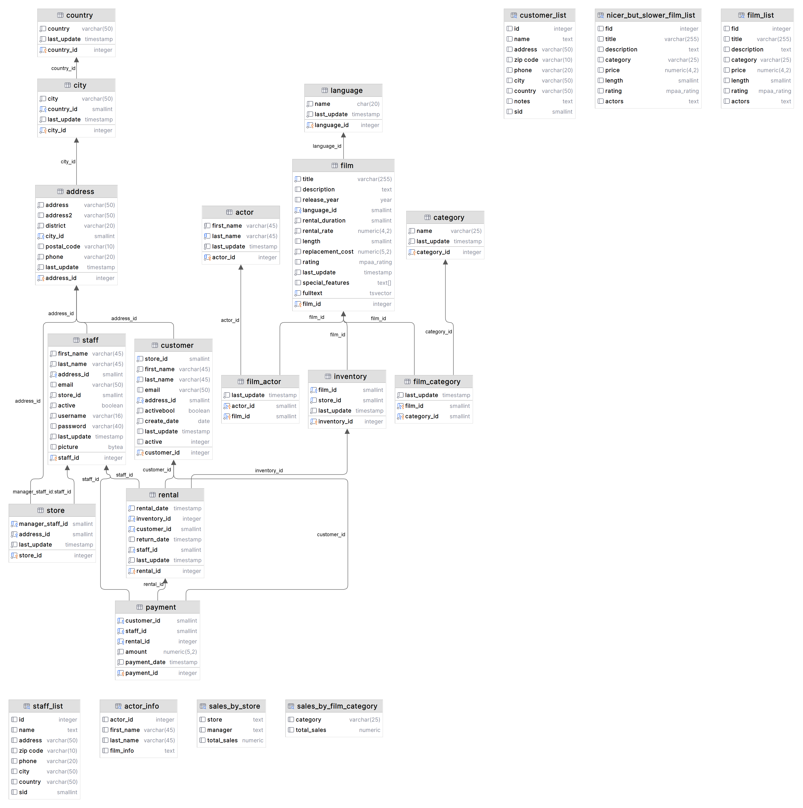

# DVD Rental PostgreSQL Project

This project presents a compilation of SQL queries, exhibiting different SQL functionalities.  Each query has been developed with the DVD Rental Database. The database includes tables such as film, inventory, rental, payment, category, film_category among others. The schema is rendered using DataGrip.


## 1. IN and Sub-Query
The following SQL query is designed to retrieve the film IDs and titles of all films rented by a specific customer, identified by the `customer_id` of 1.

```sql
SELECT f.film_id, f.title
FROM film f
WHERE f.film_id IN (
    SELECT i.film_id
    FROM rental r
    INNER JOIN inventory i ON r.inventory_id = i.inventory_id
    WHERE r.customer_id = 1
);
```

## 2. ORDER BY and Aggregation
This SQL query lists each payment and the associated movie, ordered by the total payment amount. This is achieved by merging data from multiple tables - `payment`, `rental`, `inventory`, and `film`.

```sql
SELECT
    m.title,
    SUM(p.amount) AS total_amount
FROM
    payment p
JOIN
    rental r ON p.rental_id = r.rental_id
JOIN
    inventory i ON r.inventory_id = i.inventory_id
JOIN
    film m ON i.film_id = m.film_id
GROUP BY
    m.film_id
ORDER BY
    total_amount DESC;
```

## 3. COUNT, DISTINCT, and HAVING
The next SQL query aims to identify stores that carry more than 50 unique movies, using the `COUNT DISTINCT` function on the `film_id` column grouped by `store_id`. It's important to note that the clause `HAVING number_of_movies > 50` cannot be used in the query.

```sql
SELECT store_id, COUNT(DISTINCT film_id) AS number_of_movies
FROM inventory
GROUP BY store_id
HAVING COUNT(DISTINCT film_id) > 50;
```


## 4. UNION
The following query retrieves unique customer_ids who have either rented films from category 5 or made a payment greater than 20. It uses a `UNION` operator to combine results from two `SELECT` statements.
```sql
SELECT customer_id FROM film_category 
INNER JOIN inventory ON film_category.film_id = inventory.film_id
INNER JOIN rental ON inventory.inventory_id = rental.inventory_id
WHERE category_id = 5
UNION
SELECT customer_id FROM payment WHERE amount > 20;
```

## 5. EXCEPT
The next SQL query provides a list of customers who have rented films from the 'Comedy' category but have never rented films from the 'Drama' category. It accomplishes this by using the `EXCEPT` operator to exclude customers who have rented Drama films from the list of customers who have rented Comedy films.
```sql
-- Customers who have rented Comedy films
(SELECT r.customer_id
 FROM rental r
 JOIN inventory i ON i.inventory_id = r.inventory_id
 JOIN film f ON f.film_id = i.film_id
 JOIN film_category fc ON fc.film_id = f.film_id
 JOIN category c ON c.category_id = fc.category_id
 WHERE c.name = 'Comedy')

EXCEPT

-- Customers who have rented Drama films
(SELECT r.customer_id
 FROM rental r
 JOIN inventory i ON i.inventory_id = r.inventory_id
 JOIN film f ON f.film_id = i.film_id
 JOIN film_category fc ON fc.film_id = f.film_id
 JOIN category c ON c.category_id = fc.category_id
 WHERE c.name = 'Drama');
```
## 6. Window Function - SUM OVER
This query shows running total payments for each customer, ordered by the payment date. The running total is calculated by using a `SUM` function with a window defined by the `PARTITION BY` clause.

```sql
SELECT
    payment_date,
    customer_id,
    amount,
    SUM(amount) OVER(PARTITION BY customer_id ORDER BY payment_date) as running_total
FROM payment;
```

## 7. Window Function - RANK OVER

The following SQL query retrieves a ranking of customers based on their total payment amount. The rank is determined using the `RANK()` function with an `ORDER BY` clause specifying descending order of the sum of payment amounts.
```sql
SELECT
    customer_id,
    SUM(amount) as total_payment,
    RANK() OVER (ORDER BY SUM(amount) DESC) as payment_rank
FROM payment
GROUP BY customer_id;
```

## 8. Nested CTEs
This nested CTE-based query provides the total payment made by each customer for the most rented film. It uses three CTEs: `film_rentals` to calculate total rentals for each film, `most_rented_film` to find the film with the most rentals, and `customer_payments` to calculate total payments by each customer for the most rented film.

```sql
-- film_rentals: finds the total rentals for each film
WITH film_rentals AS (
    SELECT film_id, COUNT(rental_id) as total_rentals
    FROM inventory
    JOIN rental ON inventory.inventory_id = rental.inventory_id
    GROUP BY film_id
),

-- finds the film with the most rentals
most_rented_film AS (
    SELECT film_id
    FROM film_rentals
    ORDER BY total_rentals DESC
    LIMIT 1
),
--  calculates the total payment made by each customer for the most rented film
customer_payments AS (
    SELECT payment.customer_id, SUM(payment.amount) as total_payment
    FROM payment
    JOIN rental ON payment.rental_id = rental.rental_id
    JOIN inventory ON rental.inventory_id = inventory.inventory_id
    WHERE inventory.film_id = (SELECT film_id FROM most_rented_film)
    GROUP BY payment.customer_id
)
SELECT *
FROM customer_payments
ORDER BY total_payment DESC;
```
## 9. CASE WHEN
This SQL query categorizes customers based on their total spending into 'Low spender', 'Medium spender', and 'High spender'. This is achieved using a `CASE WHEN` statement inside the `SELECT` clause.

```sql
SELECT 
  customer_id,
  SUM(amount) AS total_spend,
  CASE
    WHEN SUM(amount) < 50 THEN 'Low spender'
    WHEN SUM(amount) >= 50 AND SUM(amount) < 150 THEN 'Medium spender'
    ELSE 'High spender'
  END AS spending_category
FROM 
  payment
GROUP BY 
  customer_id
ORDER BY 
  total_spend DESC;
```

## 10. SQL Function

Pagination is frequently used in web applications when retrieving data, as it allows us to limit the number of results fetched at a time. This practice significantly reduces the overhead on the database, enhancing application performance.

The following SQL defines a function, `get_films_paginated`, which retrieves a paginated list of films from the film table. The function takes two parameters - page number and number of films per page, and returns a table structure with the specified film fields.

```sql
-- pagination of film
CREATE OR REPLACE FUNCTION get_films_paginated(page_num INTEGER, per_page INTEGER) 
RETURNS TABLE(
    film_id integer,
    title VARCHAR(255),
    description TEXT,
    release_year year,
    language_id smallint,
    rental_duration smallint,
    rental_rate NUMERIC(4, 2),
    length smallint,
    replacement_cost NUMERIC(5, 2),
    rating mpaa_rating,
    last_update TIMESTAMP,
    special_features TEXT[],
    fulltext TSVECTOR
)
LANGUAGE plpgsql AS $$
BEGIN
RETURN QUERY 
    SELECT *
    FROM film
    ORDER BY film_id
    LIMIT per_page 
    OFFSET (page_num - 1) * per_page;
END; $$;
```

```sql
SELECT * FROM get_films_paginated(2, 30);
```

The function `get_films_paginated` is then called with arguments `(2, 30)` to retrieve the second page of films, assuming 30 films per page.